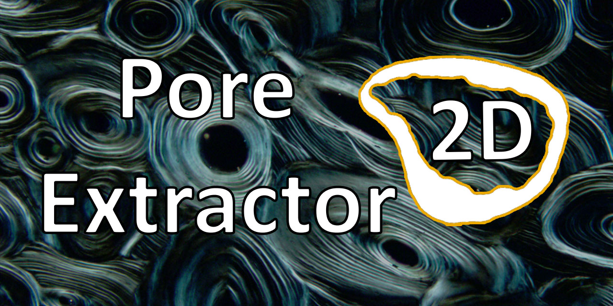
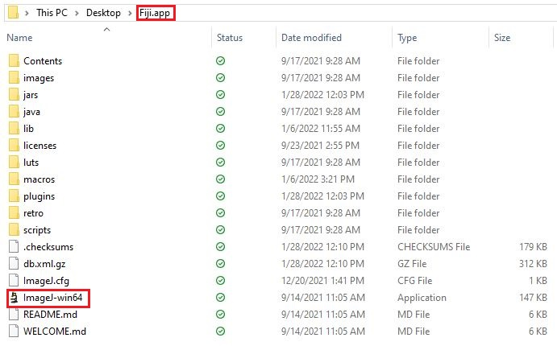
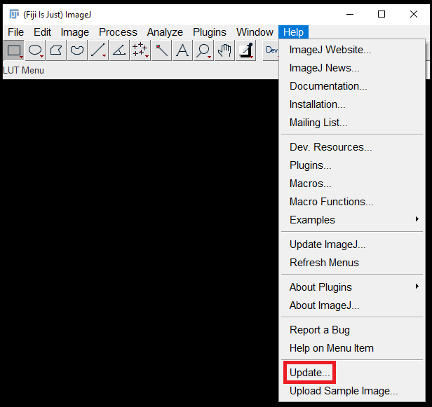
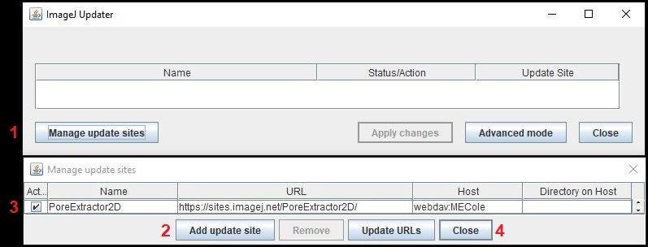
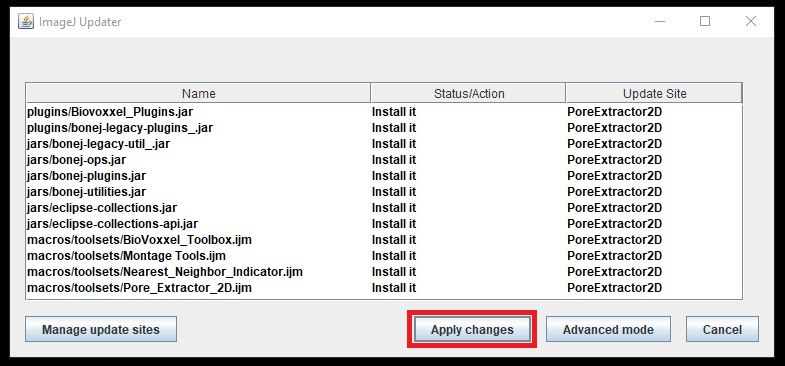
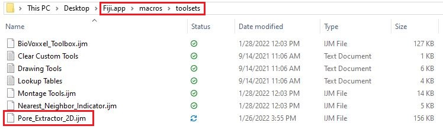
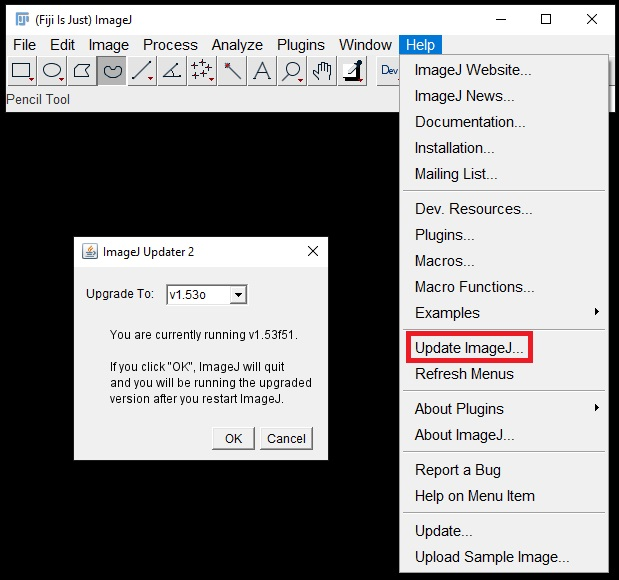
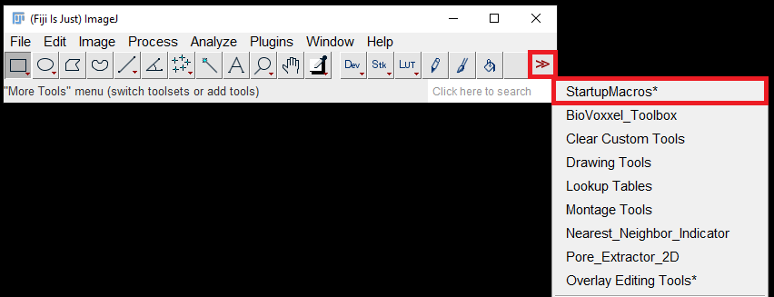
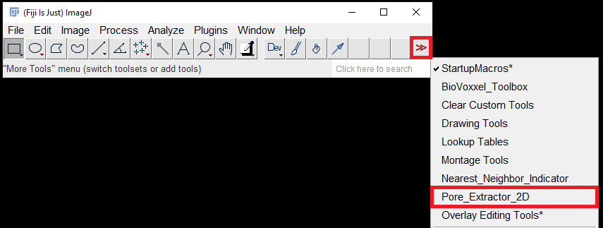
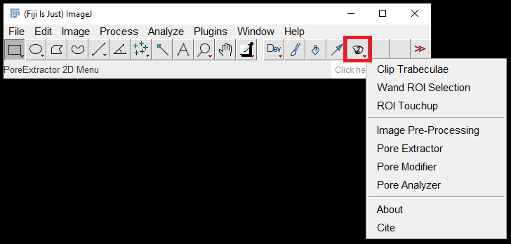

## Description

Pore Extractor 2D is a free, open source macro toolkit for the FIJI distribution of ImageJ. This toolkit expedites the annotation and morphometric analysis of cortical pores on transverse histological cross-sections of bone tissue.

### Macro Tools

- **Clip Trabeculae:** Keyboard shortcuts for clipping trabecular struts and sealing cortex cracks
- **Wand ROI Selection:** Automatically select and clear space external to section borders
- **ROI Touchup:** Adjust the section borders exported by *Wand ROI Selection*
- **Pore Extractor:** Computer-assisted segmentation of pore spaces
- **Pore Modifier:** Keyboard shortcuts and functions for manually correcting the extracted pore ROI set
- **Pore Analyzer:** Automated morphometric analysis, including pore type classification and regional subdivision

### Citation

Mary E. Cole, Samuel D. Stout, Victoria M. Dominguez, Amanda M. Agnew. 2022. Pore Extractor 2D: An ImageJ toolkit for quantifying cortical pore morphometry on histological bone images with application to intraskeletal and regional patterning. American Journal of Biological Anthropology (In Press).

## Installation

Pore Extractor 2D requires ImageJ FIJI version **1.53g** or later distribution.
Downloads and system requirements can be found at: https://imagej.net/Fiji/Downloads

Unzip the download and extract the Fiji.app folder. If installing on Windows, the folder should be stored somewhere on the user space (e.g. Desktop, Documents), rather than in Program Files, to facilitate write permissions. 

ImageJ can be opened by clicking on the application within the Fiji.app folder.

The current version of Pore Extractor 2D should be installed from its ImageJ update site. This update site also automatically installs the Pore Analyzer tool dependencies BoneJ (Doube et al., 2010) and BioVoxxel Toolbox (Brocher, 2015). 

The user will be prompted to close and restart ImageJ several times during this installation process. 

**1.**	Open the ImageJ application and navigate to **Help -> Update.** If the ImageJ installation is new, several default updates may install, the user will be prompted to **Apply Changes**, close ImageJ, re-open ImageJ, and call **Help -> Update** again.  

**2.**	Select **Manage update sites**, then **Add update site**, and input the following information: 

- **Name:** PoreExtractor2D
- **URL:** https://sites.imagej.net/PoreExtractor2D/
- **Host:** webdav:MECole

Then select **Close** to be returned to the **Manage update sites** window. 

**3.** Pore Extractor 2D dependencies will populate in the **Manage update sites** window. Note that only “Pore_Extractor_2D.ijm” will populate if the user previously installed BoneJ and Biovoxxel dependencies. Select **Apply changes**. The user will be prompted to restart ImageJ.

After download, the “Pore_Extractor_2D.ijm” file will appear in the Fiji.app subfolder **macros -> toolsets**.

If the user encounters difficulties downloading from the update site, the “Pore_Extractor_2D.ijm” file downloaded from this repository can be manually copied into the toolset subfolder. In this case, the user would also need to install BoneJ and BioVoxxel Toolbox individually from the ImageJ Update menu.

**4.** Navigate to **Help -> Update ImageJ** and update to the latest version (1.53g or later). ImageJ will close automatically after this update and will need to be restarted.

## Pore Extractor 2D Session Startup Instructions

Pore Extractor 2D must be installed each time a new session of ImageJ is opened.

**1.** If the user plans to clean section borders with the *Clip Trabeculae* or *Wand ROI Selection* macros, the FIJI Brush tool must be installed by selecting “StartupMacros” from the “More Tools” (**>>**) dropdown menu. This utility replaces the default ImageJ Brush tool.

**2.** Select “Pore_Extractor_2D” from the “More Tools” (**>>**) dropdown menu, and the toolkit icon will appear in the ImageJ toolbar.

**3.** Click the Pore Extractor 2D toolkit icon to select a macro from its dropdown menu.

